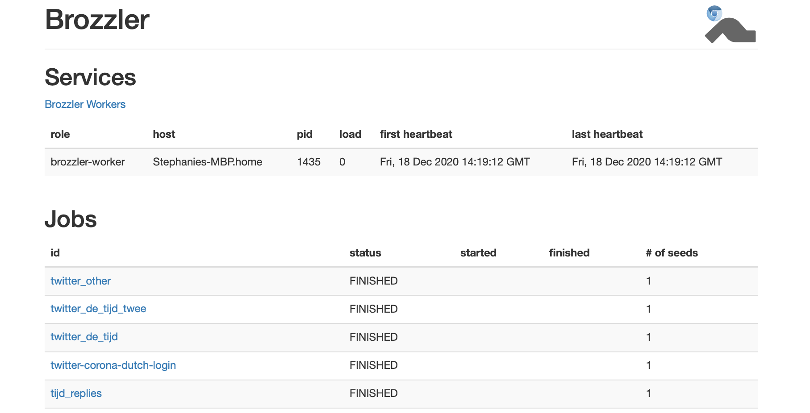
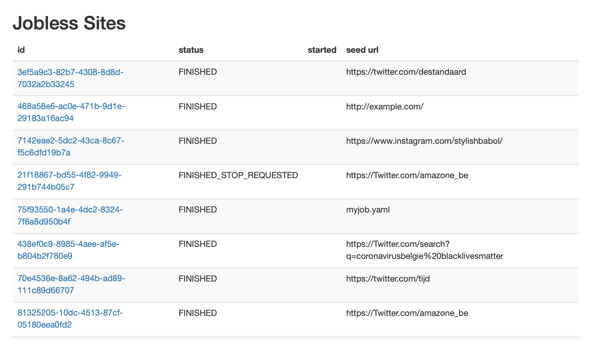
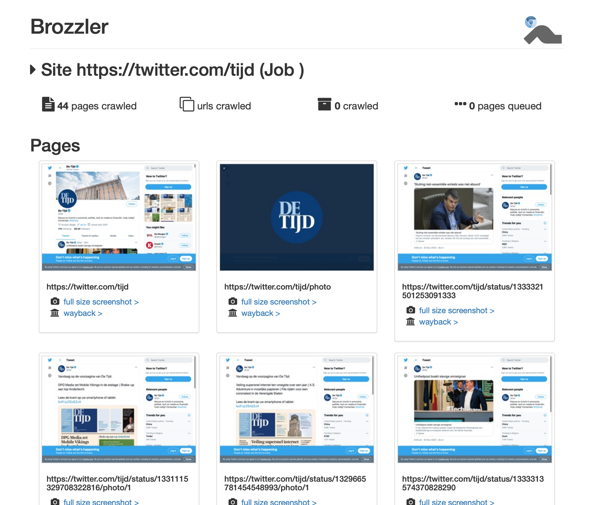
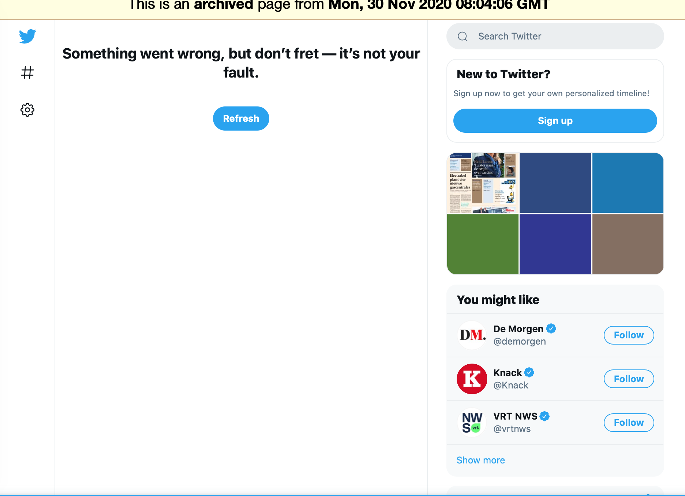

# Brozzler

**This documentation was created in November/December 2020**

## Introduction
Brozzler is a distributed web crawler which uses a browser to fetch pages and embedded URLs and to extract links.
This tool is recommended to crawl any social media including Instagram, Twitter, Facebook, Youtube and Soundcloud. Platforms such as Wix, Sidearm Sports or seeds where multiple redirects prohibit replay in Wayback. Even though Instagram and Twitter were recommended, in the last version of brozzler 27/11 it is noticed that Instagram and Facebook blocked robot.txt (which can be circumvented but unethical).

Brozzler has an Apache-2.0 License and is an active repository with the last update being 10/2020. 
It depends on **Python 3.5 or later, RethinkDB deployment and Chromium or Google Chrome >= version 64**. 
A very important note is that this tool needs a graphical interface, meaning that if a server or any system with none 
available user should use additional infrastructure, typically X11. Xvnc4 and Xvfb are X11 variants that are suitable 
for use on a server. At time of testing Xvfb did not support screenshots, so Xvnc4 is preferred in this case.


### Youtube_dl
Brozzler employs youtube-dl to enhance media to capture capabilities and rethinkdb to manage crawl state. 

### Warcprox
Brozzler is designed to work in conjuction with warcprox for web archiving. Warcprox is an active repository last updated 09/2020 (GPL, opensource). This is a tool which is an HTTP proxy designed for archiving web applications. It is used in parallel with brozzler. Warcprox  stores its traffic to disk in the Web ARChive (WARC) file format.
In essence this tool captures encrypted HTTPS traffic by using the "man-in-the-middle" technique. 
The proxy only sees the raw data and thus can not analyse it and only forwards data.

### RethinkDB
NOTE : According to [projectcest](https://www.projectcest.be/wiki/Publicatie:Archiveren_van_sociale_media_in_Amsab-ISG#Brozzler) and in the issue section of brozzler github, rethinkDB is no longer in development or support and may cause problems in the future. However, the repository seems to be active and are actively searching for new contributors. Last update made on the github repository was on 10/2020.

## Features
Brozzler is a powerful crawler, it deviates from the "standard" webcrawlers as in its reliance on an actual web browser
to interact with web content before that content is indexed and archived into WARC files. Instead of following 
hyperlinks and downloading files, Brozzler records interactions between servers and web browsers as they occur, 
resembles how a human user would experience the web. Brozzler is capable of crawling with or without respecting the robot.txt rules. 
The user can specify quite a few parameters such as the limit of the hop count, pages that should not be further archived, 
which pages should not at all, which should always be archived, etc. The user can specify why it is crawling and contact information so that 
the website which is being archived can contact the archiver which is good practice in crawling. Brozzler 
has a dashboard option to see in real time the status of the running and finished jobs. Brozzler wayback offers 
display of the archived websites.

## Setup/Installation (5-15 minutes)

* Is a docker container available: none made by the official brozzler team.
* How long did it take to install the tool: 5-15 minutes
* What other software needs to be installed : rethinkDB (which is a database) and Chromium or Google Chrome >= 64 version (browser used to crawl on).
* Which data needs to be provided during setup : none


## Installation script 
There is an installation script available in this repository which can automate your installation process. This script does not include the [rethinkDB download](https://rethinkdb.com/docs/install/), it is specific to the computers operating system. We will be using a virtual environment thus before using the tool please always activate your environment first (source brozzler_env/bin/activate). It may be possible that you will need to retry downloading the easy and dashboard command when they are not recognized using:
```
pip install brozzler[easy]
pip install brozzler[dashboard]
```

## Manual download
For more information on what to do when you are working remotely [click here](https://gitlab.ilabt.imec.be/besocial/tool-comparison/remote-access-gui)

1. set up a virtual environment to ensure using python 3, make sure you have version 3.5 or above.
```console
$ python3 -m venv brozzler_env
$ source brozzler_env/bin/activate
```

2. Installing rethinkDB
For Mac the following commands will do : 
```console
$ brew install rethinkdb
```
For Linux/Windows/... download rethinkdb's installer by selecting your operating system and following the steps : https://rethinkdb.com/docs/install/

3. Installing Chromium or Google Chrome >= version 64  

**Not working remotely** download [here](https://www.google.com/chrome/)

**Working remotely**
```console
Make sure you have wget if not download using
$ sudo apt install wget
Get google chrome 64 using the following link
$ wget https://dl.google.com/linux/direct/google-chrome-stable_current_amd64.deb
Install the downloaded chrome page
$ sudo dpkg -i google-chrome-stable_current_amd64.deb
If errors occurred during installation do the following to fix them
$ sudo apt-get install -f
```

Run google chrome using 
```console
$ google-chrome
```

4. Installing the tool
```console
$ pip install brozzler
install brozzler with special dependencies pywb and warcprox
$ pip install brozzler[easy]
web application to view crawl job status
$ pip install brozzler[dashboard]
when segment faults occur during download and then try to redownload the package which went wrong
$ rm -rf ~/.local
```

To be able to use Brozzler wayback :
Write a configuration file pywb.yml.
```
# 'archive_paths' should point to the output directory of warcprox
archive_paths: warcs/  # pywb will fail without a trailing slash
collections:
  brozzler:
    index_paths: !!python/object:brozzler.pywb.RethinkCDXSource
      db: brozzler
      table: captures
      servers:
      - localhost
enable_auto_colls: false
enable_cdx_api: true
framed_replay: true
port: 8880
```

5. Using the tool: 
* start up the rethinkdb using (chose a http-port which is not in use at the moment, default 8080):
```console
$ rethinkdb --bind all --http-port 8085 
```
* start a job (2 possible ways: specify job via the yml file or queue a site)
```console
queue a site to crawl
$ brozzler-new-site http://example.com/
or a job
$ brozzler-new-job job1.yml 
```
* start brozzler
note: When started, your Chrome browser will be started to crawl. Do not close the windows which are crawling.
```console
start brozzler-easy
$ brozzler-easy
```
* open dashboard
```console
$ brozzler-dashboard
```
* open wayback
```console
$ PYWB_CONFIG_FILE=pywb.yml brozzler-wayback
```
Then you can browse http://localhost:PORTNO/brozzler/.

5. Stopping a job 
Killing a job is not possible via the interface, it is only possible via commandline.

Example closing a jobless site:
brozzler-stop-crawl --site 9f90b6d4-a60b-4096-9c3d-bac38bd03116
The id can be found in the first column of the jobless sites.

Example closing a job:
brozzler-stop-crawl --job jobname

Note: If the id was found no error will be shown. After a while(! takes a bit of time!) the job will be marked 
with FINISHED_STOP_REQUESTED as status.

## Configuration of the tool
* How is Twitter/Facebook/Instagram accessed? All are accessed by passing the link to the tool or by setting it up in the .yml file.
* How  can the output destination be changed : warcprox_meta field in the configuration file sets the filenames of the WARC files created by a job.
* Can a configuration file be given: Yes, In the yml file you can specify quite a few parameters.

Example of a YML file: 
```
id: myjob
time_limit: 60 # seconds 
proxy: 127.0.0.1:8000 # point at warcprox for archiving
ignore_robots: false # in general follow the robot.txt rules
max_claimed_sites: 2
warcprox_meta:
  warc-prefix: job1
  stats:
    buckets:
    - job1-stats
metadata: {}
seeds:
- url: http://one.example.org/ # no timelimit specified thus inherited from the top-level time_limit
  warcprox_meta:
    warc-prefix: job1-seed1
    stats:
      buckets:
      - job1-seed1-stats
- url: http://two.example.org/
  time_limit: 30
- url: http://three.example.org/
  time_limit: 10 # time limit of this specific seed
  ignore_robots: true #robot.txt rules are ignored bad practice
  scope:
    surt: http://(org,example,
```

### Short tutorial
Brozzler jobs are defined using YAML files. We have top-level options and individual seeds. In this top-level we give a name to be able to easily identify and later find the harvested job. We can optionally add a timelimit which will be the time in seconds the crawler will harvest every job. In the seeds we will define the different urls we would want to harvest in this one job. These seeds (at least one!) must contain a url. A seed may or may not define a time limit. If not defined the top level must have one, as it will be inherited from there when missing. Useful to know is that every seed has the option to add a username and password, which will be filled in every post request which has a login type. It will fill in your credentials and go on. 

A scope algorithm is available which allows you to block harvesting to some pages, or accept it no matter what. Max hop limits and such are also defined with the scope. 

The scope algorithm works as follows:
1. max_hops reached? (YES: out of scope) 
2. Page is explicitely blocked? (YES: out of scope) 
3. Page explicitely accepted? (YES: in scope)
4. If the max_hop_off hops from the last page which was in scope of an accept rule (YES: in scope)
5. In all other cases it will be out of scope.

The user can specify the maximum claimed sites belonging to a job so that jobs with many seeds will not starve other jobs. Lastly there are a few ettiquette rules which are good practice to follow, such as respecting the robot.txt. Brozzler allows circumventing robot.txt if toggled. The user-agent header has the possibility of identifying itself web servers. It can include a project URL with a notice to webmasters as to why you are crawling, how to block it and how to contact the operator if the crawler is causing problems.

### Extensive tutorial
Brozzler jobs are defined using YAML files. Options may be specified either at the top-level or on individual seeds. 
In this example the top level is the lines between warcprox_meta: and metadata: {}. Everything specified here is inherited automatically to the seeds.
The seeds are specified after "seeds:", there must be atleast one seed and a seed must contain a time limit and an url. All other options are truely
optional. When a seed for example specifies a time limit it will not look at the top level time limit. So when contradicing it will chose to ignore. 
However, when none is present it will look at top level to find the time limit. This will also be the case for other options. A special case is when 
an option is specified both at the top level and at the seed level, then the results are merged. 

In the current example we will see that top-level and the first seed are alike thus it will be merged as follows : 
```
warcprox_meta:
  warc-prefix: job1-seed1
  stats:
    buckets:
    - job1-stats
    - job1-seed1-stats
```

Other optional options then are specifying your id string (otherwise auto generated by rethinkdb).
The user can specify the maximum claimed sites belonging to a job so that jobs with many seeds will not starve other jobs.

Brozzler also allows cawling in non-interactively way. This is done by passing a username and/or password for the seed. 
Brozzler will then look for forms on each of the crawled pages and fill in your information.

Metadata will give more information on the crawl job or the site. This is for personal use, brozzler will not use the information.

A http proxy can be passed, typically pointing to warcprox. 
It is good practice for crawlers to follow the robot.txt rules. However, brozzler allows the user to decide whether or not to follow these rules. 
It is also a good ettiquette to include a project URL with a notice to webmasters which explains why you are crawling, 
how to block the crawler via robots.txt, and how to contact the operator if the crawl is causing problems. This can be added with the user_agent option.


A user can also limit the scoping: When brozzler finished processing a page it now has a list of pages which are href-ed. 
With this list brozzler will check the maximum amount of hops the user has specified in the configuration file 
and the list of domains to accept or block. Links which are newly discovered are queued, older links are now prioritized.

The scope algorithm works as follows:
1. max_hops reached? (YES: out of scope) 
2. Page is explicitely blocked? (YES: out of scope) 
3. Page explicitely accepted? (YES: in scope)
4. If the max_hop_off hops from the last page which was in scope of an accept rule (YES: in scope)
5. In all other cases it will be out of scope.

Brozzler canonicalizes the seed URL using the urlcanon library's "semantic" canonicalizer, 
then removes the query string if any, and finally serializes the result in [SSURT](https://github.com/iipc/urlcanon/blob/master/ssurt.rst) form. 
For example, a seed URL of https://www.EXAMPLE.com:443/foo//bar?a=b&c=d#fdiap becomes com,example,www,//https:/foo/bar.

The user can also specificy substrings, such that when the value is found anywhere in the canonicalized form it will be in scope. 
The same for regex, ssurt, surt or parent_url_regex.

warcprox_meta sets the filenames of the WARC files created by a job. If we would give 2 urls then we might want different prefixes. 
We would then do it as follows :

```
seeds:
- url: https://example.com/
  warcprox_meta:
    warc-prefix: seed1
- url: https://archive.org/
  warcprox_meta:
    warc-prefix: seed2
    limits:
    my-job/new/wire_bytes: 100000000
```

In this example a limit of the job size is using limits.
More info about the configuration file can be found [here](https://github.com/internetarchive/brozzler/blob/master/job-conf.rst)

The error handling of wrong setup of the configuration file is clear, when something is wrong it will make clear how to change
options for it to work when passing your job.yml to the brozzler tool.

Example format of passing the password and username was not correct and password must be of the form string:
```
bad value: null
seeds:
- 1:
  - url:
    - required field
  2:
  - password:
    - must be of string type
    url:
    - required field
```

## Creating a new collection (general)
* Web interface available to create/edit a collection? It is possible to see the status of the harvesting, the amount of crawls in queue and the amount which is done. You can see the screenshots of pages and replay warc files. Editing, creating and stopping crawls is not possible on the web interface. This should be done in the commandline. There is also a webinterface called Brozzler Wayback which allows you to search for a collection and to view the harvested pages (also integrated in the brozzler dashboard).
* Possible to use different user accounts to manage collections? No, this tool requires no accounts.
* What content can be archived? Posts, replies, etc? 
    1. Instagram : without circumventing robot.txt you can not archive anything.
    2. Facebook : without circumventing robot.txt you can not archive anything.
    3. Twitter : does not block with robot.txt public profiles, trends, posts, replies on posts all that would be visible when looking at the site without login can be harvested. However only one screenshot every page and warc file showing "Something went wrong, but don't fret -- it's not your fault" message from Twitter.

Examples for public pages:
https://twitter.com/tijd
https://twitter.com/destandaard

The warc files can be found here of the warc files harvested in this repository directory

Note to archive some of the content you must be logged in. Brozzlers login option does not seem to work on Twitter.

## Monitoring a collection
This use case covers the monitoring of an existing collection, for example a collection about 
“#COVID-19” tweets which are harvested around the clock or a collection of specific accounts twice per day.

* Can the harvest of a collection be paused/resumed? All the jobs can be "paused" at the same time by stopping the brozzler-easy. When starting brozzler-easy again the jobs will continue. Jobs can not be seperately "paused". When a brozzler job has been stopped using brozzler-stop-crawl, this can not be restarted or resumed. When a job finished it also can not be restarted. Thus the resume option is really just absent in this tool.
* Is it visible in the user interface how many errors occurred? No, you can only see when replaying the warc file if something went wrong or that nothing has been harvested.

## Creating an account-based selection
This use case covers the collection of a list of social media accounts to archive, for example deMorgen, nieuwsblad and knack.

* Can you provide several social media accounts?
Yes, you can do this by giving the urls of the different media accounts to different seeds.
* How far back in time you can harvest the posts of a specific social media account?
You can go as far back as the data is available in the platform.

## Creating a keyword-based selection
This use case covers the collection of social media posts related to a specific event or keyword, 
for example if you ask the Twitter API to return all tweets for a certain hashtag or search string.

When starting up different jobs at the same time the crawler will alternate these jobs so that not 
only one is crawled

1. search for noël a trend in Belgium via yaml file and passing passwords. Running the job with "brozzler-new-job job.yml"
```
id: twitter_noel_login
time_limit: 900 # seconds
ignore_robots: false
warcprox_meta: null
metadata: {}
seeds:
  - url: https://twitter.com/search?q=%23Noël&src=trend_click&vertical=trends
  - username: myusername
  - password: mypassword
```

2. multiple public pages
```
id: twitter_standaard_tijd
time_limit: 900 # seconds
ignore_robots: false
warcprox_meta: null
metadata: {}
seeds:
  - url: https://twitter.com/destandaard
seeds:
  - url: https://twitter.com/tijd
```

3. Instagram "brozzler-new-site https://www.instagram.com/explore/tags/coronavirusbelgium/"
This will create a job by simply passing the link if you wish to not further specify the job.

## Examples of web interface 
### Overview of harvests which had a yaml file (thus a job)

### Overview of jobless harvests

### Harvest result

### Replay of the warc retrieved with brozzler wayback

### Screenshot in the harvest


## Error handling
There are all kinds of things which can go wrong, e.g. the internet connection might drop, the social media API might be not available or a rate limit for consuming the content might be reached. It is valuable metainformation for a collection to know when which kind of error happened, e.g. to assess if a day of social media posts is missing.

When the internet connection drops for a while the harvest will also be declared to be finished. 
When the database is shut off the harvest will stop and automatically resume its jobs when it is turned on again.

The error handling in Brozzler is not ideal. When crawling of pages does not work out, there is little information on what went wrong. Errors that did show : when chrome did not start up, when the site was blocked by robot.txt rules. The errors can be seen on the brozzler-easy terminal, this is a stream of output with gets, finishes and errors. This terminal is quite cluttered and difficult to find the one block where something went wrong. If you have multiple jobs running you would have an impossible long scroll to find what went wrong for this specific crawl. On the web interface you cen not see errors but you can look at the warc file replays to look at what is crawled up till now. You might be able to see "desired pages are not found" when checking into the warc files or in case of twitter "something went wrong". 

Facebook and Instagram pages are all blocked with robot.txt. Twitter seems to successfully hide that it has a login system as it does not every seem to login. Furthermore all pages have one single screenshot (which is just a little slice of what should've been harvested) and a warc file with replays of only "something went wrong". Error depends on the page it is crawling in the web interface, since they are the one generating the error instead of Brozzler. When brozzler itself failed it will show a html page where it is said to not be able to find the page you are looking for.

Examples of problems:

1. Crawling on a search on Twitter does not work, no error was shown. 
The retrieved page only contained a Twitter page with something went wrong. 
brozzler-new-site https://twitter.com/search?q=coronavirusbelgie%20blacklivesmatter&src=typed_query

2. Passing a job with job.yml crawling a hashtag page of covidbelgium : https://www.instagram.com/explore/tags/covidbelgium/ job.yml stopped by robot.txt:
```
id: myjob
time_limit: 60 # seconds
ignore_robots: false
warcprox_meta: null
metadata: {}
seeds:
  - url: https://www.instagram.com/explore/tags/covidbelgium/
```

3. multiple public pages
```
id: twitter_standaard_tijd
time_limit: 900 # seconds
ignore_robots: false
warcprox_meta: null
metadata: {}
seeds:
  - url: https://twitter.com/destandaard
seeds:
  - url: https://twitter.com/tijd
```
Most pages of de tijd had "Something went wrong", and some had links such as https://twitter.com/tijd/status/13333313574370828290/likes could not be found in this collection.

## Issues encountered

### Platforms
Instagram and Facebook are blocked by robot.txt. Brozzler login does not work on Twitter and all warc files contain "something went wrong". The screenshots for every page however works, but only shows a very small part of the page. In the examples folder we have added the warc file of the harvest "twitter.com/tijd".

### Terminal counts
There are quite a few terminals which should be open at all times. This is quite confusing, running some as a background process will be better.

terminal 1 : rethinkdb
terminal 2 : brozzler-dashboard
terminal 3 : brozzler-easy
terminal 4 : job creation and passing
terminal 5 : google-chrome

brozzler-easy gives a bit of error feedback, thus can not be run in the background.

### Web interface limited
The brozzler-dashboard interface becomes very cluttered, as you cannot delete jobs you have done in the past, it just mounts to a lot of jobs. 
You can also not stop jobs on the interface or start them up without a command line. Errors along the way should be added here. Unknown what 
tool would do when a post, picture or website is not found. Will it try again later? Useful to know with error handling.

### Error handling 
Error handling is quite poor, cluttered in the brozzler-easy output. Furthermore some errors are not even shown (such as successful crawls with "something went wrong") explained in error handling section.


## Conclusion
Brozzler is a powerful crawling tool which makes remaining to look-and-feel of the page possible. 
It uses WARC files and rethinkdb to manage these. Brozzler offers a dashboard interface which allows a structured view of 
what the status is of all the different jobs and summaries of their configurations and the pages that are crawled and queued.
The integrated wayback offers the possibility to immediately see the pages that have been archived (when ongoing or after). There are possibilities
to work non-interactively by passing your username and password of the platforms per seed. Many jobs can be started at the same time 
by adding different seeds in one configuration file, they will harvest in an alternating manner.

Even though this tool is very powerful in crawling like a user, allowing scrolling and so forth. It has a very limited dashboard
interface. Jobs which are no longer needed can not be deleted from the dashboard and clutters your structure. 
Jobs can also not be stopped or paused on it. Needing the commandline tools to do so. The error handling is one of the bigger problems
as there is difficulty into seeing what went wrong in the brozzler-easy output. A lot of clutter and sometimes even no error. You can only be sure the harvest was successful by checking the replay of the warc file in the web interface. Furthermore if your internet would be down, the crawl stops and has no way of being resumed. If the brozzler-easy is stopped, all jobs stop and will be continue when starting brozzler-easy again. Resuming or continueing a finished/stopped crawl is not implemented. 

This tool has considered various ethical principles as notifying the webmaster with information about the crawl and robot.txt are respected. However as we choose not to circumvent robot.txt it means that Instagram and Facebook can not be crawled. The login does not work on Twitter and the warc files always end up with the message "Something went wrong", which is probably Twitter changing their website to block crawlers.

Lastly the crawls are quite slow as 46 pages of de tijd were crawled in 1 hour. This is probably caused by the chrome overhead but also the api limitations of Twitter.

This tool is very generic, designed to work for all websites. Thus it is up to the user to check for each social-media platform which is harvestable and which allow login and what ethical rules are wished to be followed.
