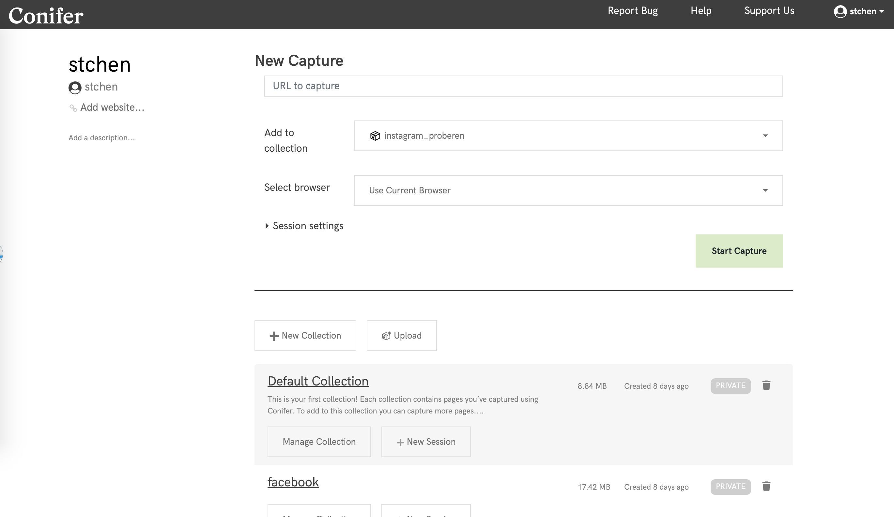
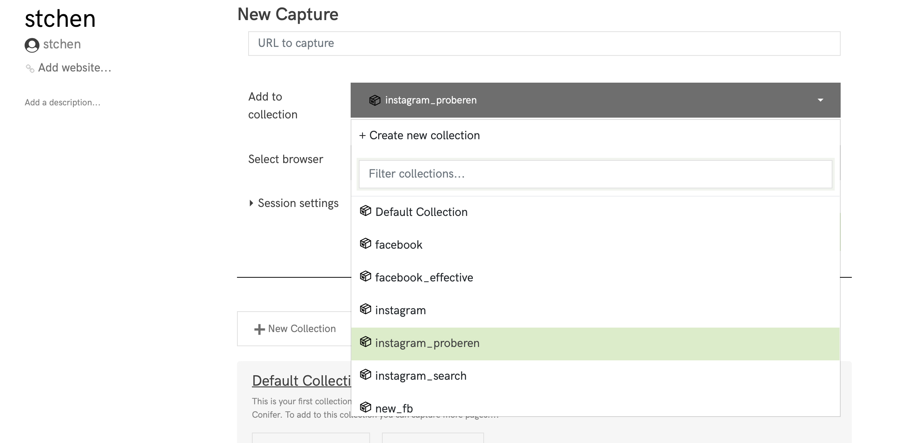
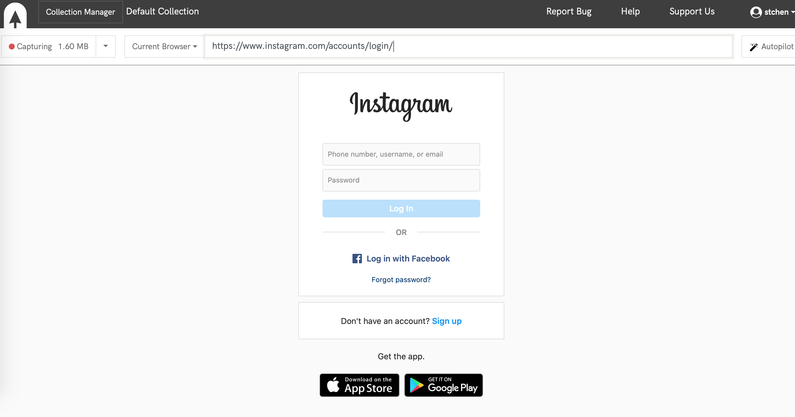
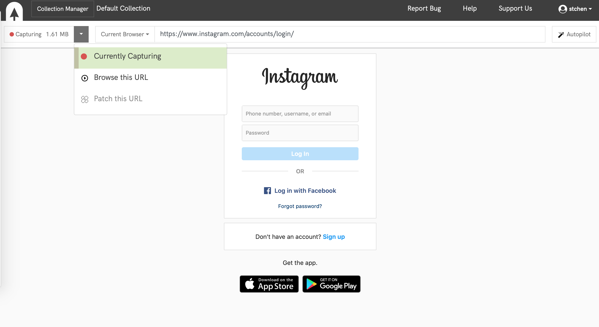
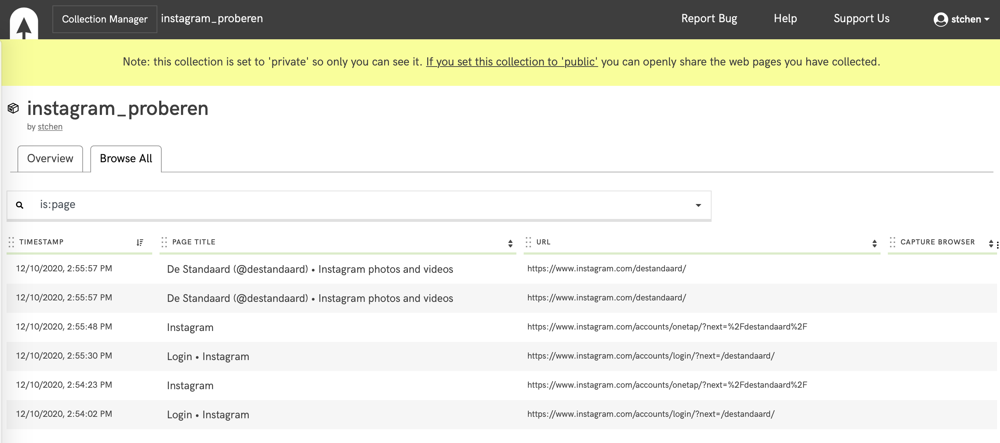
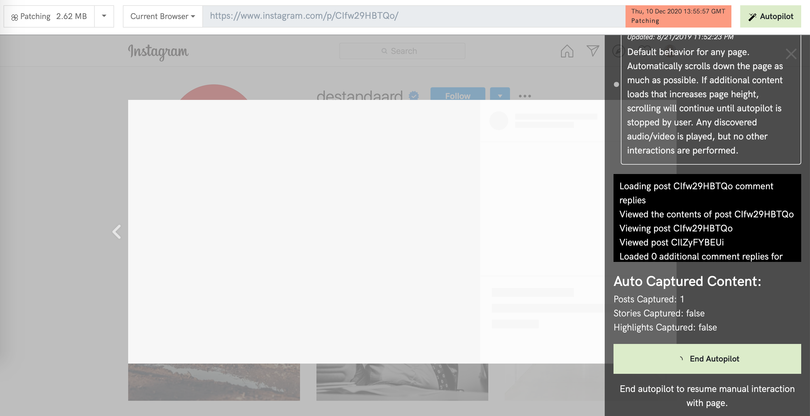

# Webrecorder/Conifer

**This documentation was created in November/December 2020**


## Introduction
Conifer is a web archiving service that creates an interactive copy of any web page that you browse, including content revealed by your interactions such as playing video and audio, scrolling, clicking buttons, and so forth. This tool is a fully open souce platform for archiving the web maintained by Rhizome, a non-profit arts organization. It is licensed with Apache and last update was on 8/2020.

This guide tests the available web service and not the setup of the server itself.

## Features
Conifer is easy to use service with no ads or exploitation of user data. A user can register on their website [webrecorder.io](http://webrecorder.io/).Every user is given 5GB of storage for organizing and sharing web collections without charge. A user can also use docker to set up their own website. The user who uses the website does not need any prior command-line or programming knowledge. Scrolling will be done automatically and any discovered audio/video is played, but no other interactions are performed. As the tool works with urls, it is possible to crawl Facebook, Twitter and Instagram. Login can be done manually with the browsing option before capturing. Every social media platform often has their own extra autopilot feature to crawl data in a more targetted fashion. Such as the Twitter timeline and the Instagram User Page.

## Installation/setup  (about 0 min)

* Is a docker container available: Yes, [dockerlink](https://github.com/Rhizome-Conifer/conifer)
* How long did it take to install the tool with the setup: 0 minutes if you use the website. docker 
* What other software needs to be installed : None for website, docker and docker-compose when docker is used
* Which data needs to be provided during setup : None.

There is no installation or setup of the tool. The only thing you need to do is make an account which only asks for basic information. Then you need to confirm with your email account. 

Another option is to use the docker setup.

## Configuration of the tool
* How is Twitter/Facebook/Instagram accessed? Through the web interface different urls can be given to crawl. With this basic url you can then manually look for the page you wish to definitely crawl, or login if needed. 
* How  can the output destination be changed : The data will be downloaded, thus the user can choose to change the name and the download destination.
* Can a configuration file be given: No, configuration is done via the web interface.

### Data output format
Results replay can be checked on the website. Collections can be downloaded as warc file.

## Creating a new collection (general)
* Web interface available to create/edit a collection? Yes.
* What content can be archived on Instagram, Twitter and Facebook? Posts, replies, etc? 

### General
On the main panel you can add a new url which you would like to capture. You may select or add a collection (private or public) in which you would like to categorize this url. The last stem is then to select an available browser or your current one. Each session can have its own description. If you already have collections you can also scroll through them and add a session there. 

You can replay the archived files by selecting the collection manager and selecting the page you wish to check. 

The common issue with these 3 social media platforms is that the login on the pages is incredibly difficult for the first few times. It needs many times of trial and error, it often seems impossible to login. Sometimes the websites instantly send you to a page that says you can not login, suspicious activity. Sometimes they ask for 2 factor authorization and it loops into the same login all the time. And Some of the cases it works. It seems to notice you are crawling and is also alerted by the fact that you are using a device from another country.

NOTE: It is often the case that the autopilot can not start and must wait for the page to load first. It is suggested to restart the process.
Note: To paste a link into the browser of Conifer you will need to press on the location where you want to type. Then go on the clipboard icon on the website itself, paste the text in the textbox that will appear. Then you will have successfully pasted the text into the browser. The other way around is also possible.

### Twitter
For Twitter if you do not login and visit a public page such as "tijd". You will see that the crawler is unable to see any of the data. It can only see the banner of The profile and all tabs of the replies, or tweets mention "Something went wrong". So the user must login to harvest. Then two options are offered. 

When you are logged in and on a public page the autopilot will give you 2 options:
1. **Twitter timeline** : Capture every tweet, including quotes, embedded videos, images, replies and/or related tweets in thread.
2. **Default scrolling** : Default behavior for any page. Automatically scrolls down the page as much as possible. If additional content loads that increases page height, scrolling will continue until autopilot is stopped by user. Any discovered audio/video is played, but no other interactions are performed.

### Instagram
When using instagram the user must be logged in to crawl a public page.
1. **Instagram User Page** : Capture all stories, images, videos and comments on user’s page.
2. **Default scrolling** : Default behavior for any page. Automatically scrolls down the page as much as possible. If additional content loads that increases page height, scrolling will continue until autopilot is stopped by user. Any discovered audio/video is played, but no other interactions are performed.

On your own feed you can see the following options:
1. **Instagram User Feed** : Capture all stories, images, videos and comments on the logged in users feed.
2. **Default scrolling** : Default behavior for any page. Automatically scrolls down the page as much as possible. If additional content loads that increases page height, scrolling will continue until autopilot is stopped by user. Any discovered audio/video is played, but no other interactions are performed.

### Facebook
To crawl facebook pages it is not necessary to be logged in.

1. Capture all items and comments in the Facebook page and scroll down to load more content where possible. **This behavior is not currently supported**
2. **Default scrolling** : Default behavior for any page. Automatically scrolls down the page as much as possible. If additional content loads that increases page height, scrolling will continue until autopilot is stopped by user. Any discovered audio/video is played, but no other interactions are performed.

So when you crawl pages on facebook it will not be possible to expand the comments. But the linked pages can be clicked upon. It will not open in the Conifer website browser. It will try to open the page and not find it. So what you can do is select that url and press on the clipboard icon. Then copy paste the text found in the clipboard and paste it in your actual browser to see. Cascade harvesting is not possible.

You can crawl everything that you want on facebook with the restrictions that only the default scrolling option can be used. In the user search bar you can first search on your own profile what you would like to crawl with filters such as locations for events, dates, categories and so on. Important to note is that Facebook crawls the locations are only specified per city. Country might be handy in some cases instead.

## Monitoring a collection
This use case covers the monitoring of an existing collection, for example a collection about 
“#COVID-19” tweets which are harvested around the clock or a collection of specific accounts twice per day.

* Can the harvest of a collection be paused/resumed? There are options to recrawl the page and an option to patch the page which fetches the things that are missing in your page.
* Is it visible in the user interface how many errors occurred? As you set it up you can see if all everything is correct or not. During autopilot it will not show errors. You would manually need to check the replays.

There is a list of collections which helps with the structure. Then you can manage these collections and check the pages which you have already crawled with sessionid, page title, url, timestamp and browser.  

During download you can see feedback on what is being crawled at the moment and in total. 
This is an example from Instagram.

```
Viewed post CIZBf-yAXsp
Loaded 0 additional comment replies for post CIZBf-yAXsp
Loading post CIZBf-yAXsp comment replies
Viewed the contents of post CIZBf-yAXsp
Viewing post CIZBf-yAXsp
Viewed post CIdTzq9hjyx
Loaded 0 additional comment replies for post CIdTzq9hjyx
Loading post CIdTzq9hjyx comment replies
Viewed the contents of post CIdTzq9hjyx
```

```
Auto Captured Content:
Posts Captured: 12
Stories Captured: false
Highlights Captured: false
```

## Creating an account-based selection
This use case covers the collection of a list of social media accounts to archive, for example deMorgen, nieuwsblad and knack.

* Can you provide several social media accounts? No, you must find the link for each of these, and depending on the platform first login for each of them.
* How far back in time you can harvest the posts of a specific social media account?
As far as possible for a regular user, as it does not use the API's

## Creating a keyword-based selection
This use case covers the collection of social media posts related to a specific event or keyword, 
for example if you ask the Twitter API to return all tweets for a certain hashtag or search string.

### Twitter 
1. Harvesting from the public profile page Tijd.
https://twitter.com/tijd
2. Harvesting from the an advanced search url. For more information on advanced search check [here](https://twitter.com/search-advanced). In this case we harvested the videos which are related to #corona #belgique.
https://twitter.com/search?q=%23corona%20%23belgique&src=typed_query&f=video

### Facebook
1. Harvesting from the public profile page Tijd.
https://www.facebook.com/detijd
2. Harvesting from the an advanced search retrieved from facebook. You can do this on your profile by entering a keyword in the search bar and selecting the type of data you want. In this case we are harvesting events whith the keyword Covid and located in Ghent, Belgium.
https://www.facebook.com/search/events?q=covid&filters=eyJycF9ldmVudHNfbG9jYXRpb246MCI6IntcIm5hbWVcIjpcImZpbHRlcl9ldmVudHNfbG9jYXRpb25cIixcImFyZ3NcIjpcIjEwMjE1NTQ2MzE1OTI3OVwifSJ9

### Instagram
1. Harvest public profile de tijd
https://www.instagram.com/de.tijd/
2. Harvest hashtag covidbelqigue
https://www.instagram.com/explore/tags/covidbelgique/

## Error handling
There are all kinds of things which can go wrong, e.g. the internet connection might drop, the social media API might be not available or a rate limit for consuming the content might be reached. It is valuable metainformation for a collection to know when which kind of error happened, e.g. to assess if a day of social media posts is missing.

There seems to be no error handling, you will need to check manually if the auto pilot did what you wanted. If the internet would drop the process would stop.


## Examples of web interface 
### Main page

### Starting new harvest with in a new or exisitng collection

### Harvest redirected to login automatically

### Options during harvest

### Collection manager of a specific collection

### Patch a harvested collection : starting

### Patch a harvested collection : running


## Issues 

### Login
Logging into a social media page is very difficult and slow process. It often just without any reason doesn't let you go through

### Lack of automation 
When passing an url and you need to login, you basically need to retype the url again after the process. If you need to harvest multiple profiles it takes a lot of time to setup each of them. 

### Autopilot
Often the autopilot seems to be waiting for pages to load indefinitely. Ending autopilot sometimes also doesn't seem to ever end.

### Session Ending
Session ending without notice about 10 minutes into patching an Instagram User page.

## Conclusion 
This tool is very easy to use. It is designed to be user-friendly and allows people without knowledge of programming or command line to be able to efficiently use this tool. Conifer automatizes the process of harvesting by scrolling for you and allows videos and audios to be played. On different platforms and different types of pages (such as public profiles, user feeds,...) it sometimes offers a more specific crawling method. Allowing users to get a more targetted solution. These would for example allow Twitter to capture every tweet, including quotes, embedded videos, images, replies and/or related tweets in thread. Which is richer than the default option. The interface allows a structered view on your harvests and managing of the collections. The collections are downloaded in warc format. Patching and refetching pages is essential features for when harvests are paused and resumed.

Conifer allows up to 5gb free storage per person on the website. For an upgraded storage a fee is requested, which can be found [here](https://supporter.conifer.rhizome.org/). When using docker Redis database will be used as local storage.

The tool can crawl all kinds of sites as it only requires an url. However, there is no error handling when issues occur and the process of logging in (often a requirement) is slow and the process can require many trials. The auto-pilot often does not respond as it says the page is loading. This tool is quite slow as it has a lot of overhead of sending their browser to yours. for every page or user account you want to harvest a seperate harvest and login must be set up, which is time consuming.
